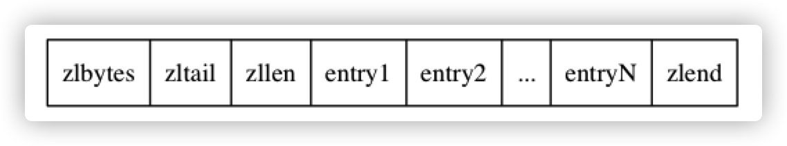

# 7.0 压缩列表 zipList

压缩列表是**列表键与哈希键**底层实现之一。

## 构成

| 属性      | 类型       | 长度     | 用途                                                         |
| :-------- | :--------- | :------- | :----------------------------------------------------------- |
| `zlbytes` | `uint32_t` | `4` 字节 | 记录整个压缩列表占用的内存字节数：在对压缩列表进行内存重分配， 或者计算 `zlend` 的位置时使用。 |
| `zltail`  | `uint32_t` | `4` 字节 | 记录压缩列表表尾节点距离压缩列表的起始地址有多少字节： 通过这个偏移量，程序无须遍历整个压缩列表就可以确定表尾节点的地址。 |
| `zllen`   | `uint16_t` | `2` 字节 | 记录了压缩列表包含的节点数量： 当这个属性的值小于 `UINT16_MAX` （`65535`）时， 这个属性的值就是压缩列表包含节点的数量； 当这个值等于 `UINT16_MAX` 时， 节点的真实数量需要遍历整个压缩列表才能计算得出。 |
| `entryX`  | 列表节点   | 不定     | 压缩列表包含的各个节点，节点的长度由节点保存的内容决定。     |
| `zlend`   | `uint8_t`  | `1` 字节 | 特殊值 `0xFF` （十进制 `255` ），用于标记压缩列表的末端。    |

## 节点构成

### previous_entry_length

**`previous_entry_length` 属性的长度可以是 `1` 字节或者 `5` 字节：**

- 如果前一节点的长度小于 `254` 字节， 那么 `previous_entry_length` 属性的长度为 `1` 字节： 前一节点的长度就保存在这一个字节里面。
- 如果前一节点的长度大于等于 `254` 字节， 那么 `previous_entry_length` 属性的长度为 `5` 字节： 其中属性的第一字节会被设置为 `0xFE` （十进制值 `254`）， 而之后的四个字节则用于保存前一节点的长度。

0xFE ==> 254

0x05 == >5

**压缩列表的从表尾向表头遍历操作就是使用这一原理实现的： 只要我们拥有了一个指向某个节点起始地址的指针， 那么通过这个指针以及这个节点的 `previous_entry_length` 属性， 程序就可以一直向前一个节点回溯， 最终到达压缩列表的表头节点。**

### encoding

**记录了节点的 `content` 属性所保存数据的类型以及长度**

### Content

节点的 `content` 属性负责保存节点的值， 节点值可以是一个字节数组或者整数， 值的类型和长度由节点的 `encoding` 属性决定。

