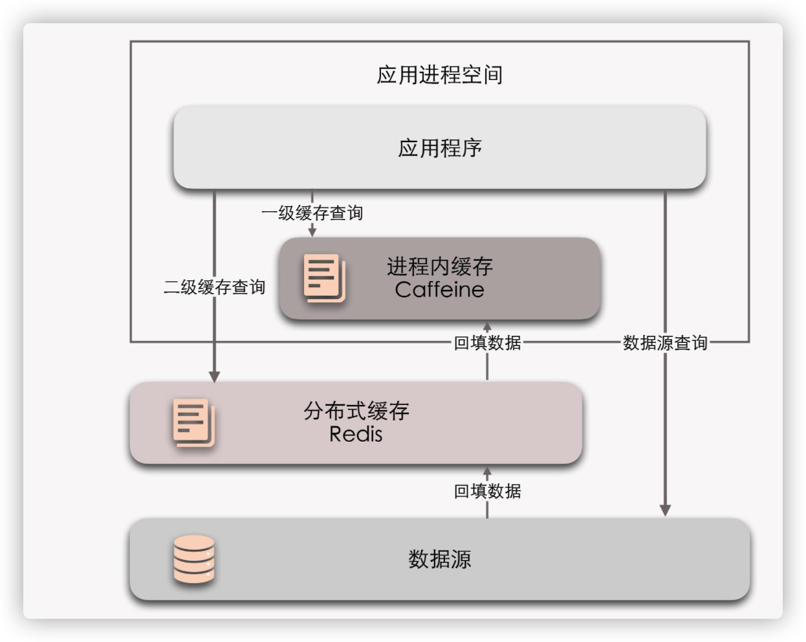

## 多级缓存

**多级缓存通用的设计原则：变更已分布式缓存中的数据为准，访问以进程内的缓存的数据优先。**

### 缓存风险及应对措施

- **缓存穿透**
  - **对于业务逻辑中本身就不能避免的缓存穿透**：在一定时间内，将返回为空的 key 继续进行缓存，效果是缓存最多被穿透一次；
  - **对于恶意攻击导致的缓存穿透**：设置布隆过滤器（简单来讲就是设置请求集合匹配）。
- **缓存击穿**
  - **加锁同步**：以请求该数据的 Key 值为锁，只将第一次出现击穿的事件请求到数据源中去，之后更新缓存后再获取对应的缓存数据；
  - **热点数据进行自动化更新**：对缓存进行动态的检测失效及更新，做到自动化管理缓存。
- **缓存雪崩**
  - 提升缓存系统可用性，建设分布式缓存的集群；
  - 启用透明多级缓存，各个服务节点的一级缓存中的数据，通常会具有不一样的加载时间，这样做也就分散了它们的过期时间；
  - 将缓存的生存期从固定时间改为一个时间段内的随机时间。
- **缓存污染**
  - 缓存污染多数是因为开发者更新缓存不规范造成的。。。。

**Cache Aside 模式**

1. 读数据时，先读缓存，缓存没有的话，再读数据源，然后将数据放入缓存，再响应请求。
2. 写数据时，先写数据源，然后失效（而不是更新）掉缓存。

