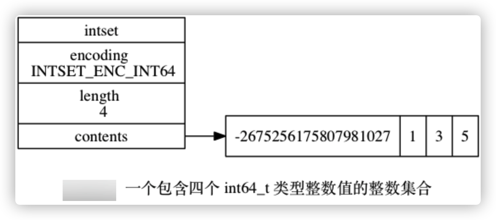

# 6.0 整数集合


**整数集合（intset）是集合键的底层实现之一： 当一个集合只包含整数值元素， 并且这个集合的元素数量不多时， Redis 就会使用整数集合作为集合键的底层实现。**


## 6.1 整数集合的实现

````c
typedef struct intset {

    // 编码方式
    uint32_t encoding;

    // 集合包含的元素数量
    uint32_t length;

    // 保存元素的数组
    int8_t contents[];

} intset;
````

`contents` 数组是整数集合的底层实现： 整数集合的每个元素都是 `contents` 数组的一个数组项（item）， 各个项在数组中按值的大小从小到大有序地排列， 并且数组中不包含任何重复项。

`length` 属性记录了整数集合包含的元素数量， 也即是 `contents` 数组的长度。



