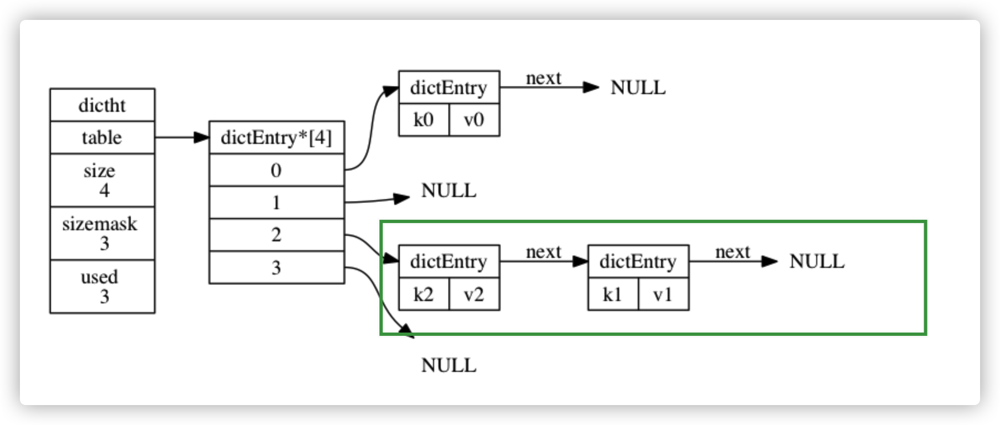

# 4.3 解决键冲突

当有两个或以上数量的键被分配到了哈希表数组的同一个索引上面时， 我们称这些键发生了冲突（collision）。

**Redis 的哈希表使用链地址法（separate chaining）来解决键冲突**： 每个哈希表节点都有一个 `next` 指针， 多个哈希表节点可以用 `next` 指针构成一个单向链表， 被分配到同一个索引上的多个节点可以用这个单向链表连接起来， 这就解决了键冲突的问题。

**因为 `dictEntry` 节点组成的链表没有指向链表表尾的指针， 所以为了速度考虑， 程序总是将新节点添加到链表的表头位置（复杂度为 O(1)）， 排在其他已有节点的前面。**

