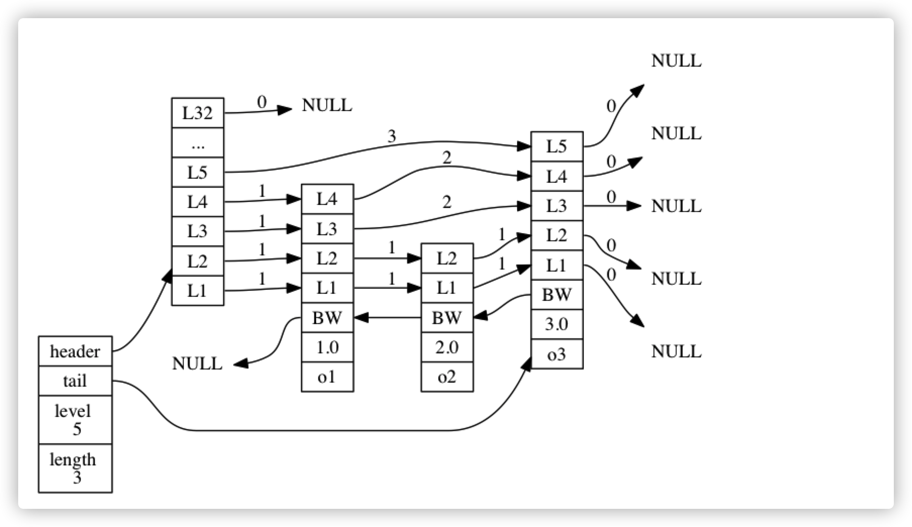

# 5.0 跳跃表

**跳跃表（skiplist）是一种有序数据结构， 它通过在每个节点中维持多个指向其他节点的指针， 从而达到快速访问节点的目的。**


跳跃表 =》 有序集合键


**跳跃表在 Redis 使用：**

- **实现有序集合键；**
- **在集群节点中作为内部数据结构。**


## 跳跃表的实现


````c
typedef struct zskiplistNode {
    robj *obj;
    // 分值
    double score;
    // 后退指针
    struct zskiplistNode *backward;
    // 层
    struct zskiplistLevel {
        // 前进指针
        struct zskiplistNode *forward;
        // 跨度
        unsigned int span;
    } level[];
} zskiplistNode;


typedef struct zskiplist {
    struct zskiplistNode *header, *tail;
    unsigned long length;
    int level;
} zskiplist;
````





### zskiplist Struct

- `header` ：指向跳跃表的表头节点。
- `tail` ：指向跳跃表的表尾节点。
- `level` ：记录目前跳跃表内，层数最大的那个节点的层数（表头节点的层数不计算在内）。
- `length` ：记录跳跃表的长度，也即是，跳跃表目前包含节点的数量（表头节点不计算在内）。


## 总结

- 跳跃表是有序集合的底层实现之一， 除此之外它在 Redis 中没有其他应用。
- Redis 的跳跃表实现由 `zskiplist` 和 `zskiplistNode` 两个结构组成， 其中 `zskiplist` 用于保存跳跃表信息（比如表头节点、表尾节点、长度）， 而 `zskiplistNode` 则用于表示跳跃表节点。
- 每个跳跃表节点的层高都是 `1` 至 `32` 之间的随机数。
- 在同一个跳跃表中， 多个节点可以包含相同的分值， 但每个节点的成员对象必须是唯一的。
- 跳跃表中的节点按照分值大小进行排序， 当分值相同时， 节点按照成员对象的大小进行排序。